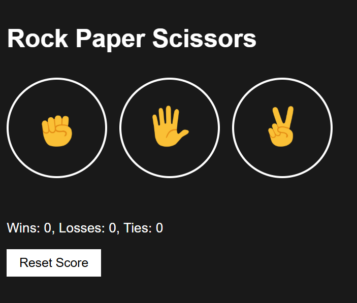
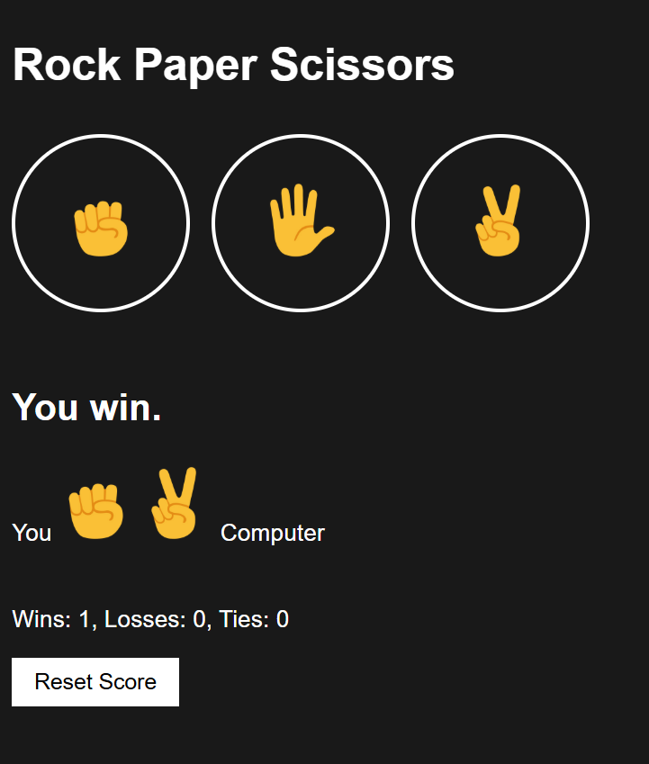
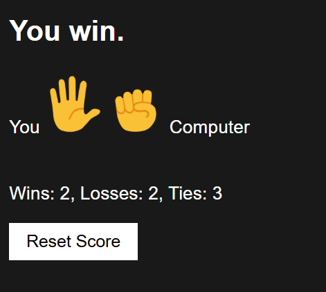

# 🎮 Rock Paper Scissors Game

An interactive web-based Rock Paper Scissors game with score persistence and a beautiful emoji-driven interface.

## ✨ Features

- 🎯 Simple and intuitive interface with emoji buttons
- 💾 Automatic score saving using localStorage
- 🤖 Random computer moves
- 📊 Track wins, losses, and ties
- 🔄 Reset score button for a fresh start

## 🚀 Getting Started

1. Clone the repository:
   ```bash
   git clone https://github.com/solkuzzzz/rock-paper-scissor.git
   cd rock-paper-scissor
   ```

2. Open `10-rock-paper-scissor.html` in your browser by double-clicking or using a local server:
   ```bash
   # Using Python 3
   python -m http.server 8000
   # or Python 2
   python -m SimpleHTTPServer 8000
   ```

3. Open http://localhost:8000 in your browser

## 📁 Project Structure

```
.
├── 10-rock-paper-scissor.html    # Main HTML file
├── index.js                       # Game logic
├── 10-rps.css                     # Styles
├── images/                        # Emoji images folder
│   ├── rock-emoji.png
│   ├── paper-emoji.png
│   └── scissors-emoji.png
└── README.md                      # This file
```

## 🎮 Game Rules

- **Rock** beats **Scissors**
- **Scissors** beats **Paper**
- **Paper** beats **Rock**
- Same choices result in a **Tie**

## 💡 How to Play

1. Click one of the buttons (Rock, Paper, or Scissors)
2. The computer randomly selects its move
3. The game determines the winner
4. Your score is automatically updated and saved
5. Use the "Reset Score" button to start fresh

## 📸 Screenshots

### Main Interface
<p align="center">
Game interface
    
</p>

### Game Result
<p align="center">
Game result display
    
</p>

### Score Tracking
<p align="center">
Score tracking
    
</p>

## 🛠️ Technologies Used

- HTML5
- CSS3
- JavaScript (Vanilla)
- LocalStorage API

## 👤 Author

[solkuzzzz](https://github.com/solkuzzzz)

## 📝 License

MIT

---

**Enjoy the game! 🎮**
